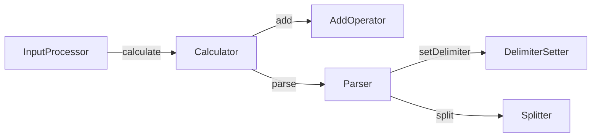

# 문자열 계산기

문자열 계산기는 사용자가 입력한 문자열에서 숫자를 파싱하고 합계를 구하는 프로그램입니다. 기본 구분자는 ','와 ':'이며, 사용자가 커스텀 구분자를 설정할 수 있습니다.

## 구현 기능 목록

- [x] 사용자가 문자열을 입력할 수 있도록 한다.
- [x] 커스텀 구분자가 설정되었는지 확인하고, 커스텀 구분자가 존재할 경우 구분자 목록에 추가한다.
- [x] 구분자를 기준으로 문자열을 분리하여 배열 형태로 저장한다.
- [x] 배열 내 문자열을 숫자로 변환한다.
- [x] 숫자를 모두 더한 값을 반환한다.

## 프로젝트 구조

```
src/
├── data/
│   ├── messages.js
│   └── regex.js
├── entities/
│   ├── AddOperator.js
│   ├── Calculator.js
│   ├── DelimiterSetter.js
│   ├── InputProcessor.js
│   ├── Parser.js
│   └── Splitter.js
├── App.js
└── index.js
```

## 상세

### 기본 구분자

기본 구분자는 쉼표(`,`)와 콜론(`:`)을 사용하여 입력 문자열의 숫자를 분리합니다.

```bash
Input: "1,2,3"
Output: 6
```

### 소수 입력 지원

입력 숫자는 양의 정수뿐만 아니라 소수 형태(`1.2`)도 지원합니다. 음수는 허용되지 않으며 에러가 발생합니다.

```bash
Input: "1.2,3.4:5.6"
Output: 10.2
```

### 커스텀 구분자

사용자는 아래 형식으로 커스텀 구분자를 설정할 수 있습니다. 커스텀 구분자는 문자로 설정하기에 한 글자만 설정할 수 있습니다. 숫자는 덧셈 연산에 사용하기 때문에 커스텀 구분자로 설정할 수 없습니다.

```bash
Input: "//[구분자]\n"
```

예시:

```bash
Input: "//@\n1@3@5"
Output: 9
```

### 입출력

프로그램의 입출력은 `@woowacourse/mission-utils`의 Console API를 통해 처리됩니다. `Console.readLineAsync()`로 입력을 받고, `Console.print()`로 결과를 출력합니다.

### 에러 처리

잘못된 입력이 주어지면, `[ERROR]`로 시작하는 에러 메시지가 출력되고 프로그램이 종료됩니다.

```bash
Input: "1;2;3"
Output: [ERROR] 구분자가 아닌 문자가 포함되어 있습니다.
```

- 음수 입력 시에도 에러가 발생합니다.
  - 예: `"-1,2,3"` → `[ERROR] ...`

## 설계

객체지향적 사고로 설계하기 위해 조영호님의 `오브젝트` 책을 읽으면서 많이 참고하였습니다.

### 도메인 설계

프로그램의 흐름을 이해하기 위해 도메인 설계를 먼저 진행하였습니다.


### 객체 책임 할당

각 도메인의 역할을 수행해줄 객체들을 만들고 객체에 책임을 할당하였습니다.



## 테스트

토론하기 채널에서 TDD 관련 글을 읽고 TDD를 적용해보기로 했습니다. 이에 따라, 설계 과정에서 고안된 객체들에 대해 실패하는 테스트 코드를 먼저 작성하고 테스트를 통과할 수 있도록 구현하였습니다.
테스트 코드는 단위 테스트 방식으로 작성하였습니다. 테스트 내용은 아래와 같습니다.

### AddOperator

- **덧셈 연산 수행**
  - 입력: `[1, 2, 3]` → 출력: `6`
  - 입력: `[100, 200, 300]` → 출력: `600`
  - 입력: `[5]` → 출력: `5`

### Calculator

- **calculate 호출 검증**
  - 입력: `'1,2,3'`, `'//;\\n1;2;3'`에서 `calculate(input)`이 호출됨
- **parse 결과 검증**
  - 입력: `'1,2,3'` → `[1, 2, 3]`
  - 입력: `'//;\\n11;12;13'` → `[11, 12, 13]`
  - 입력: `'100:200,300'` → `[100, 200, 300]`
  - 입력: `'//@\\n1,22:333@4444'` → `[1, 22, 333, 4444]`
- **add 합계 계산**
  - 입력: `[1, 2, 3]` → `6`
  - 입력: `[100, 200, 300]` → `600`
  - 입력: `[5]` → `5`

### DelimiterSetter

- **커스텀 구분자 설정 결과 반환**
  - 입력: `'1,2,3'` → 반환: `['1,2,3', [',', ':']]`
  - 입력: `'//;\\n1;2;3'` → 반환: `['1;2;3', [',', ':', ';']]`
  - 입력: `'//@\\n1@2@3'` → 반환: `['1@2@3', [',', ':', '@']]`
- **예외 케이스**
  - 기본 구분자를 커스텀으로 설정 불가: `'//,\\n1,2,3'`, `'//:\\n1:2:3'`
  - 커스텀 구분자는 1글자만 가능: `'//!!\\n1!!2!!3'`, `'//!@#!@\\n1!@#!@2!@#!@3'`
  - 숫자는 커스텀 구분자로 불가: `'//1\\n11213'`, `'//0\\n10203'`, `'//100\\n110021003'`
  - 빈 문자열/공백/개행/탭 불가: `'//\\n123'`, `'// \n1@2@3'`, `'//\n\\n1\n2\n3'`, `'//\t\\n1\t2\t3'`
  - 형식 오류: `'/;\\n1;2;3'`, `';\\n1;2;3'`, `'///;\\n1;2;3'`, `'//;m1;2;3'`, `'//;n1;2;3'`, `'//;\\1;2;3'`, `'//;1;2;3'`, `';1;2;3'`, `'//;\n1;2;3'`

### InputProcessor

- **입력 처리 및 합계 반환**
  - 입력: `'1,2,3'` → 출력: `6`
  - 입력: `'//;\\n1;2;3'` → 출력: `6`
  - 입력: `''` → 출력: `0`
- **문자열 이외 입력 예외**
  - 입력: `123`, `true`, `null`, `undefined`, `{}`, `[]` → 예외 발생

### Parser

- **parse: 숫자 배열 반환**
  - 입력: `'1,2,3'` → `[1, 2, 3]`
  - 입력: `'//;\\n1;2;3'` → `[1, 2, 3]`
  - 입력: `'//@\\n1@2,3:4'` → `[1, 2, 3, 4]`
- **setDelimiter: 원본문자열과 구분자 목록 반환**
  - 입력: `'1,2,3'` → `['1,2,3', [',', ':']]`
  - 입력: `'//;\\n1;2;3'` → `['1;2;3', [',', ':', ';']]`
  - 입력: `'//@\\n1@2@3'` → `['1@2@3', [',', ':', '@']]`
- **split: 구분자 정보로 분할**
  - 입력: `('1,2,3', [',', ':'])` → `[1, 2, 3]`
  - 입력: `('1;2;3', [',', ':', ';'])` → `[1, 2, 3]`
  - 입력: `('1@2@3', [',', ':', '@'])` → `[1, 2, 3]`

### Splitter

- **split: 구분자 기반 분할**
  - 입력: `'1,2,3'` + 구분자 `[',', ':']` → `[1, 2, 3]`
  - 입력: `'1;2;3'` + 구분자 `[',', ':', ';']` → `[1, 2, 3]`
  - 입력: `'1@2@3'` + 구분자 `[',', ':', '@']` → `[1, 2, 3]`
  - 입력: `'1]2]3'` + 구분자 `[',', ':', ']' ]` → `[1, 2, 3]`
  - 입력: `'1|2|3'` + 구분자 `[',', ':', '|' ]` → `[1, 2, 3]`
  - 입력: `'1)2)3'` + 구분자 `[',', ':', ')' ]` → `[1, 2, 3]`
  - 입력: `'1.2,3.4:5.6'` + 구분자 `[',', ':']` → `[1.2, 3.4, 5.6]`
  - 입력: `'1.2,3.4:5.6'` + 구분자 `[',', ':', '.']` → `[1, 2, 3, 4, 5, 6]`
- **예외 케이스**
  - 입력: `'1;2;3'`, `',,'`, `'1:2::3'`, `'1,2,3,'`, `'1,2;3,4'`, `',2,3'`
  - 매우 많은 숫자에서 끝/중간/연속 구분자 오류: 예) `'1,2,...,20,'`, `',2,3,...,20'`, `'1,2,...,20,,'` → 예외 발생
  - 입력: `'-1-2-3'` (구분자에 `'-'` 미포함) → 예외 발생

### Application

- **커스텀 구분자 사용 흐름**
  - 입력: `"//;\\n1"` → 출력: `"결과 : 1"`
- **예외 플로우**
  - 입력: `"-1,2,3"` → `[ERROR]`로 시작하는 예외 발생
